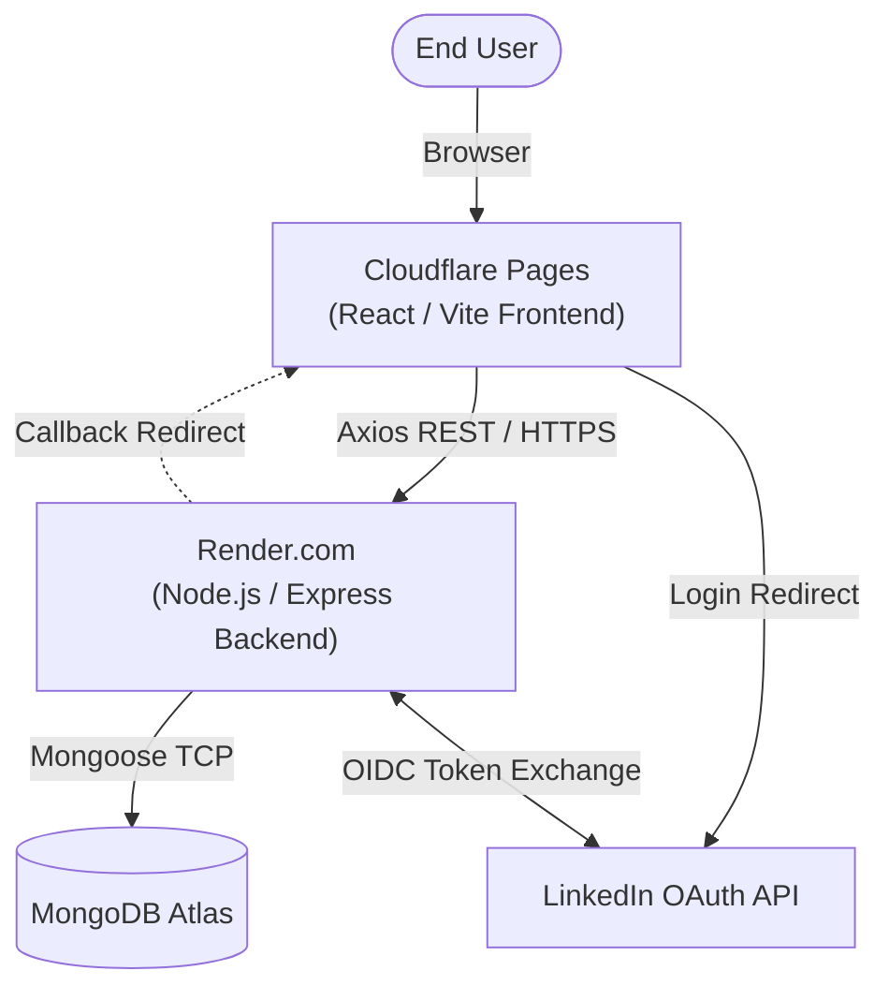

# GT-Referrals

A platform connecting Georgia Tech students (**Jobseekers**) with GT alumni working in industry (**Employees**) to facilitate job referrals through a credit-based system.

## Terminology

| Term | Description |
|------|-------------|
| **Employee** | A GT alum or industry professional who can give referrals. Registers with a company email (or personal email verified against a company domain). Earns credits by approving referrals. |
| **Jobseeker** | A GT student seeking referrals. Registers with a `@gatech.edu` email. Spends credits to request referrals. |
| **Referral** | A request from a Jobseeker to an Employee asking them to submit an internal referral for a specific job. Has a lifecycle: `pending` → `approved`/`rejected` → `submitted`. |
| **Credits** | Currency of the platform. Jobseekers spend credits to request referrals; Employees earn credits when they approve them. Refunded on rejection. |
| **Club** | A GT student organization. Shared club membership between a Jobseeker and Employee boosts the referral's **priority score**, surfacing it higher in the Employee's queue. |
| **Priority Score** | Ranking value on a referral = credits spent + shared club weight. Employees see highest-priority requests first. |
| **Company** | An employer with one or more verified email domains (e.g. `google.com`). Used to verify Employee registration. |
| **Connections** | LinkedIn connections pulled via OAuth. The recommendation algorithm surfaces Employees who share connections or clubs with the Jobseeker. |

## Systems Architecture



## Getting Started

### 1. Prerequisites

- **Node.js** v18.x or higher
- **npm** (installed with Node)
- **MongoDB** — local instance or [MongoDB Atlas](https://www.mongodb.com/atlas) connection string
- **LinkedIn App** — create one at the [LinkedIn Developer Portal](https://www.linkedin.com/developers/apps) and enable "Sign In with LinkedIn using OpenID Connect"

### 2. Installation

```bash
# Clone the repository
git clone https://github.com/DogeDevYT/GT-Referrals/
cd gt-referrals

# Install root dependencies (for running concurrent scripts)
npm install

# Install backend dependencies
cd server && npm install

# Install frontend dependencies
cd ../client/client && npm install
```

### 3. Configuration

Create a `.env` file inside `/server` with the following variables (see `.env-example`):

```
PORT=5000
MONGO_URI=your_mongodb_connection_string
LINKEDIN_CLIENT_ID=your_linkedin_app_client_id
LINKEDIN_CLIENT_SECRET=your_linkedin_app_client_secret
LINKEDIN_CALLBACK_URL=http://localhost:5000/api/auth/linkedin/callback
JWT_SECRET=a_random_secret_string
CLIENT_URL=http://localhost:5173
CLOUDINARY_CLOUD_NAME=your_cloudinary_cloud_name
CLOUDINARY_API_KEY=your_cloudinary_api_key
CLOUDINARY_API_SECRET=your_cloudinary_api_secret
```

### 4. Running the App

From the root directory:

```bash
npm run dev
```

- Frontend: http://localhost:5173
- Backend: http://localhost:5000

### 5. Testing with Mock Data

To help with testing the referral flow, several fictional FAANG employee accounts have been seeded into the database. You can log into any of these accounts using the generic password: `password123`.

- **Google**: `sundar@google.com`, `ada@google.com`
- **Apple**: `tim@apple.com`, `alan@apple.com`
- **Meta**: `mark@meta.com`
- **Amazon**: `jeff@amazon.com`
- **Netflix**: `reed@netflix.com`

---

### 6. Deployment

This repository is configured for a modern, decoupled serverless/PaaS deployment architecture:

#### Frontend (Cloudflare Pages)
1. In Cloudflare, navigate to **Pages** -> **Connect to Git** and select this repository.
2. Build Settings:
   - Framework preset: `Vite`
   - Build command: `npm run build`
   - Build output directory: `dist`
   - Root directory: `gt-referrals/client/client`
3. Add `VITE_API_URL` to the environment variables, pointing to your live backend URL (e.g., `https://your-api.onrender.com/api`).

#### Backend (Render.com)
The backend is completely fully configured with Infrastructure-as-Code via the included `render.yaml` blueprint.
1. In Render, select **New +** -> **Blueprint**.
2. Connect this repository. Render will automatically provision the Node.js Web Service on their free tier.
3. In the Render Dashboard under **Environment**, fill in your missing production variables (`MONGO_URI`, `JWT_SECRET`, `LINKEDIN_CLIENT_ID`, etc.).

---

### 7. Backend Structure

```
server/
├── config/
│   ├── db.js              # MongoDB connection
│   └── passport.js        # LinkedIn OAuth strategy
├── models/
│   ├── User.js            # Base user (discriminator: role)
│   ├── Employee.js        # Company email, credits earned, referrals given
│   ├── Jobseeker.js       # GT email, resume, clubs, credits, target companies
│   ├── Referral.js        # Links Jobseeker ↔ Employee, status, priority score
│   ├── Company.js         # Name, verified email domains
│   └── Club.js            # GT clubs with priority weight
├── middleware/
│   └── auth.js            # JWT verification + role guard
├── routes/
│   ├── auth.js            # Register, login, LinkedIn OAuth, email verification
│   ├── employees.js       # Profile, pending referrals, approve/reject
│   ├── jobseekers.js      # Profile, resume, request referral, recommendations
│   └── referrals.js       # Single referral lookup
└── index.js               # Express app entry point
```

### API Routes

| Method | Route | Auth | Description |
|--------|-------|------|-------------|
| `GET` | `/api/auth/linkedin` | — | Start LinkedIn OAuth |
| `POST` | `/api/auth/register/employee` | — | Register as Employee |
| `POST` | `/api/auth/register/jobseeker` | — | Register as Jobseeker |
| `POST` | `/api/auth/login` | — | Email/password login |
| `GET` | `/api/employees/me` | Employee | Get own profile |
| `PATCH` | `/api/employees/me` | Employee | Update own profile fields (name, title, department, tagline) |
| `POST` | `/api/employees/me/photo` | Employee | Upload or replace profile photo |
| `GET` | `/api/employees/referrals/pending` | Employee | Pending referral queue (sorted by priority) |
| `PATCH` | `/api/employees/referrals/:id/approve` | Employee | Approve referral (earn credits) |
| `PATCH` | `/api/employees/referrals/:id/reject` | Employee | Reject referral (refund Jobseeker) |
| `GET` | `/api/jobseekers/me` | Jobseeker | Get own profile |
| `PATCH` | `/api/jobseekers/me` | Jobseeker | Update own profile fields (name, tagline, roles, resume) |
| `POST` | `/api/jobseekers/me/photo` | Jobseeker | Upload or replace profile photo |
| `POST` | `/api/jobseekers/referrals` | Jobseeker | Request a referral (spend credits) |
| `POST` | `/api/jobseekers/me/resume/from-linkedin` | Jobseeker | Populate resume from LinkedIn data |
| `GET` | `/api/jobseekers/recommendations` | Jobseeker | Recommended Employees (by clubs + connections) |
| `GET` | `/api/referrals/:id` | Both | View a single referral (must be a party) |
